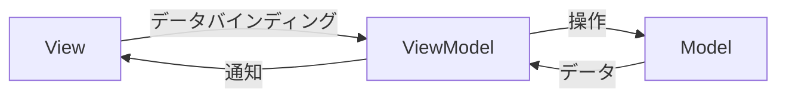

# MVVMアーキテクチャ入門

AIとの対話で作成するプレゼンテーション

  <a href="https://github.com" target="_blank" alt="GitHub" title="GitHub"
    class="text-xl slidev-icon-btn opacity-50 !border-none !hover:text-white">
    <carbon-logo-github />
  </a>

---
transition: fade-out
---

# このスライドについて

このプレゼンテーションは **Slidev** で作成されています。

- 📝 **Markdownベース** - スライドをMarkdownで記述
- 🎨 **テーマ対応** - テーマを切り替えてデザイン変更
- 🧑‍💻 **開発者フレンドリー** - コードハイライト、ライブコーディング
- 🤹 **インタラクティブ** - Vueコンポーネントを埋め込み可能
- 📤 **エクスポート** - PDF、PNG、SPAにエクスポート可能

 

AIに指示してスライドの内容を追加・編集していきましょう！

---

# 目次

このプレゼンテーションで扱う内容：

1. **MVVMとは何か** - アーキテクチャパターンの概要
2. **Model** - データとビジネスロジック
3. **View** - UIとユーザーインタラクション
4. **ViewModel** - ModelとViewの橋渡し
5. **実装例** - 実際のコード例
6. **まとめ** - 振り返りとベストプラクティス

---

# MVVMとは？

MVVM（Model-View-ViewModel）は、UIアプリケーションの設計パターンです。

 

- **関心の分離**を実現
- **テスタビリティ**の向上
- **再利用性**の促進

---
layout: center
class: text-center
---

# 続きはAIに指示してください！

スライドの追加・編集は `slides.md` を変更するだけです

[Slidev ドキュメント](https://sli.dev) · [GitHub](https://github.com/slidevjs/slidev)
