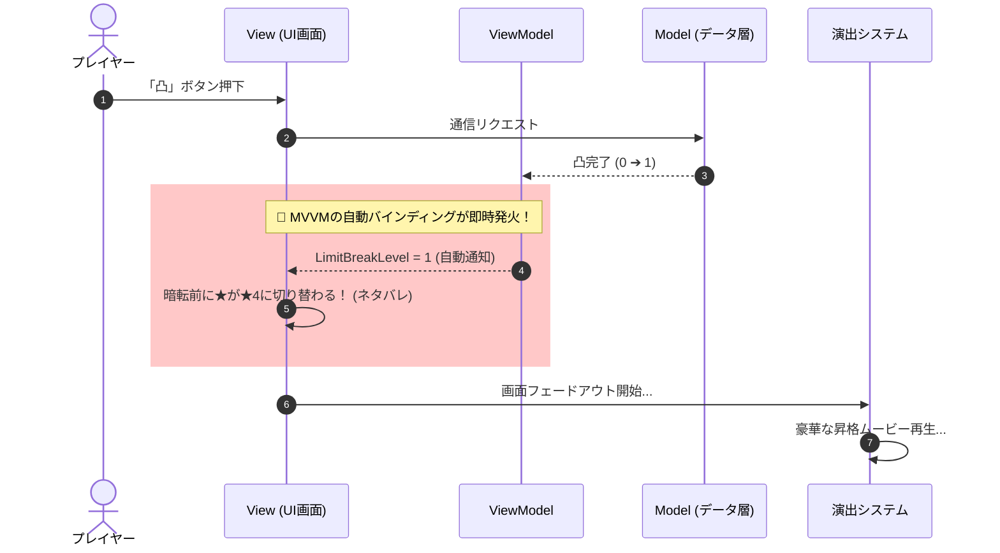

# MVVMはなぜゲームに<br><span class="text-red-400">向かない</span>と言われがちなのか？

〜 凸演出の自爆と「3つの世界」から読み解くアーキテクチャの限界 〜

<div class="pt-8 text-sm opacity-60">
  5分LT / 矢印キーでめくってください
</div>

---
layout: default
---

# 掴み：ソシャゲの「凸演出ネタバレ」

キャラクターを「凸（限界突破）」した瞬間の、あの現象。

<br>

<div class="p-6 border border-amber-500/40 rounded-xl bg-amber-500/10">

### 📱 こんな光景、見覚えありませんか？

「凸する」ボタンを押した瞬間……<br>
画面が暗転フェードする前の**ほんの1フレーム**だけ、<br>
<span class="text-red-400 font-bold text-lg">すでに凸後の「★4」にUIが更新されてネタバレしている！</span>

</div>

<br>
<v-click>

> 🚨 **実はこれ、「MVVMの教科書」を真面目に守りすぎた結果起きる自爆なんです。**

</v-click>

---
layout: default
---

# なぜあの「自爆」が起きるのか？

MVVMが**「真面目に正しく働きすぎた」**からです。



- **MVVMの教条**：「データが変わったら、1ミリの遅れもなく即座に画面へ反映する」
- **ゲームの要件**：「いや、暗転してムービーが光る瞬間まで画面は変えないで！」

---
layout: default
---

# 現場の苦渋の決断と、最大の「皮肉」

現場のエンジニアはどうやってこれを解決するでしょうか？

<br>

<div class="p-4 border border-red-500/30 rounded-lg bg-red-500/10 font-mono text-xs">
// Model ➔ ViewModel の自動バインディングを【あえて解除】する<br>
var result = await useCase.LimitBreakAsync();<br>
await view.PlayCutsceneAsync(); // 演出ムービーが終わるのを待って...<br>
<span class="text-yellow-300 font-bold">viewModel.Apply(result);</span> // ➔ ★ここで手動で同期する！
</div>

<br>

<v-click>

### 💡 ここに最大の「皮肉（パラドックス）」がある！
- **ゲーム演出を成立させるために、MVVMの売り（自動同期）を自らの手で殺している**
- 「MVVMのルールを守ると演出が壊れ、演出を守るとMVVMが壊れる」

> 😭 **「あれ……これ本当にMVVMやってる意味ある……？」** という虚無感こそが、<br>
> 「ゲームにMVVMは向かない」と言いたくなる最大の正体！

</v-click>

---
layout: default
---

# 根本原因：GUIアプリとゲームの「世界の数」

なぜこんな衝突が起きるのか？ それは**住んでいる「世界の数」が違うから**です。

<br>

<div class="grid grid-cols-2 gap-8 pt-2">

<div class="p-4 border border-blue-500/30 rounded-xl bg-blue-500/5">
  <h3 class="font-bold text-blue-400 mb-2">📱 Web / GUIアプリ（二世界）</h3>
  <div class="text-center font-mono text-sm py-2 bg-gray-900 rounded mb-2">
    Domain ➔ Presentation
  </div>
  <ul class="text-xs space-y-2 text-gray-300">
    <li>状態（State）さえ決まれば画面は一意に決まる</li>
    <li>状態の間の「遷移時間」はゼロが理想（ただのラグ）</li>
    <li><b>MVVMはこの「二世界」のために生まれた！</b></li>
  </ul>
</div>

<div class="p-4 border border-amber-500/30 rounded-xl bg-amber-500/5">
  <h3 class="font-bold text-amber-400 mb-2">🎮 ゲーム（三世界！）</h3>
  <div class="text-center font-mono text-xs py-2 bg-gray-900 rounded mb-2 text-amber-300">
    Domain ➔ <span class="text-red-400 font-bold">Simulation</span> ➔ Presentation
  </div>
  <ul class="text-xs space-y-2 text-gray-300">
    <li>物理、座標、AI、アニメーション…</li>
    <li><b>毎フレーム時間発展する巨大なシミュレーション</b>が間に居座っている！</li>
  </ul>
</div>

</div>

---
layout: default
---

# ゲームに君臨する「3つの世界」

ゲームのアーキテクチャは、本質的にこの3層で動いています。

<br>

```text
【1. Persistent Domain】（永続的なゲームルール）
    所持金、アイテム、キャラの凸段階、クエスト進行フラグ
              │
              ▼ 意味の伝播
【2. World Simulation】（毎フレーム時間発展する物理世界）★ゲーム特有！
    Transform、Rigidbody、コライダー、アニメーション遷移、移動入力
              │
              ▼ 提示の同期
【3. Presentation】（提示と演出の世界）
    カメラ演出、カットシーン、SE再生、uGUI、画面フェード
```

<br>

> 🚨 **ゲームの主役は、DomainとPresentationの間で蠢く「World Simulation」である！**

---
layout: default
---

# なぜゲームでMVVMが破綻するのか？

結論は極めてシンプルです。

<br>

<div class="p-5 border-2 border-red-500/50 rounded-xl bg-red-500/10 text-center">
  <div class="text-xl font-bold text-red-400 mb-2">
    「World Simulation」という第3の世界を、<br>
    MVVMという「二世界用の枠組み」に無理やり押し込めようとするから！
  </div>
</div>

<br>

<div class="grid grid-cols-2 gap-6 pt-2">

<div>
  <h4 class="font-bold text-red-300 mb-1">❌ View扱いした場合</h4>
  <p class="text-xs text-gray-300">「歩くプレイヤー＝PlayerView」</p>
  <ul class="text-xs space-y-1 mt-1 text-gray-400">
    <li>受動的な描画のはずのViewが、物理演算や当たり判定の重責を抱え込んで<b>巨大化・爆死（Fat View）</b></li>
  </ul>
</div>

<div>
  <h4 class="font-bold text-red-300 mb-1">❌ Model扱いした場合</h4>
  <p class="text-xs text-gray-300">「MonoBehaviourなPlayerModel」</p>
  <ul class="text-xs space-y-1 mt-1 text-gray-400">
    <li>純粋なはずのドメインモデルに、Unityの座標やUpdateが混ざり合い、<b>テスト・同期が壊滅</b></li>
  </ul>
</div>

</div>

---
layout: default
---

# 例：「Domainは判定できるが、観測できない」

クエスト「特定地点に到達したら進行」で直面する壁。

<br>

```text
1. Observation（観測 / Simulation層）
   Transform.position = (127.3, 2.0, -83.5)
      ↓
2. Spatial interpretation（空間解釈 / Simulation層）
   「指定コライダーの内側にいる」
      ↓ ─── semantic boundary ───
3. Domain interpretation（ドメイン解釈 / Domain層）
   「ReachedLocation(AncientGate) という事実が発生した」
```

<br>

<div class="text-sm space-y-1">

- Domainは「到達したら進行」という**ルールを判定**できる
- しかし、3D空間の幾何学を**自前で観測することはできない**
- この多層な意味変換を、MVVMの「状態の直接バインディング」では捉えきれない！

</div>

---
layout: default
---

# ゲームとMVVMの健全な付き合い方

<br>

<div class="space-y-4">

<div class="p-3 border-l-4 border-emerald-400 bg-emerald-500/10">
  <div class="font-bold text-emerald-300">1. 「二世界」で完結する画面は、MVVMをフル活用する</div>
  <div class="text-sm">メニュー、インベントリ、ショップ等のアウトゲーム。静的な画面ならイミュータブルなstructで十分。</div>
</div>

<div class="p-3 border-l-4 border-amber-400 bg-amber-500/10">
  <div class="font-bold text-amber-300">2. 演出という「時間」が挟まるなら、自動同期を諦めて手続きで書く</div>
  <div class="text-sm">Model ➔ ViewModelの同期タイミングを、async/awaitなどの演出シーケンスに委ねる。</div>
</div>

<div class="p-3 border-l-4 border-red-400 bg-red-500/10">
  <div class="font-bold text-red-300">3. インゲーム（3D空間・戦闘）はMVVMのメガネを外す</div>
  <div class="text-sm">3Dモデルは「View」でも「Model」でもなく「Actor」。素直にActor/Component指向、ECSを使おう。</div>
</div>

</div>

---
layout: center
class: text-center
---

# まとめ

<div class="text-xl font-bold py-6 leading-relaxed">
  ゲームでMVVMが難しいのではない。<br>
  ゲームを<span class="text-red-400">「DomainとPresentationの二世界」</span>だけで<br>
  捉えようとすることに無理があったのだ。<br><br>
  <span class="text-emerald-400">教条主義を捨て、適材適所で気持ちよくゲームを作ろう！</span>
</div>

<br>

ご清聴ありがとうございました 🙌
