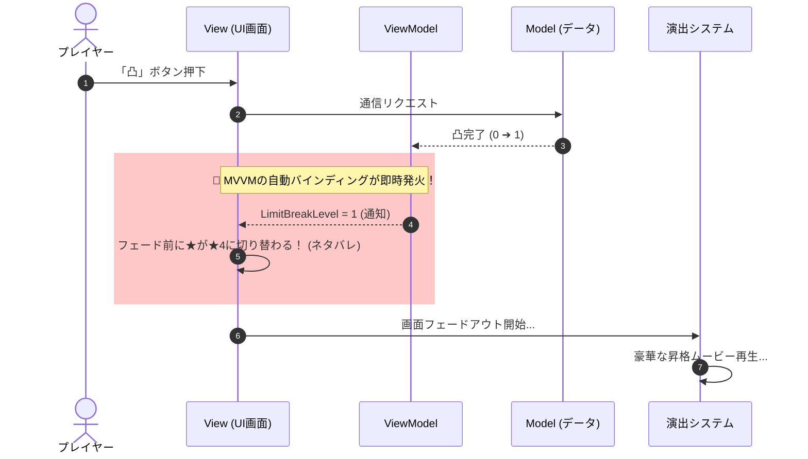

# MVVMはなぜゲームに<br><span class="text-red-400">向かない</span>と言われがちなのか？

〜 ソシャゲの「凸演出ネタバレ」から読み解くアーキテクチャの境界線 〜

<div class="pt-8 text-sm opacity-60">
  5分LT / 矢印キーでめくってください
</div>

---
layout: default
---

# あるある：ソシャゲの「限界突破（凸）」

キャラクターを凸るとき、最近のゲームは豪華な演出が入りますよね。

<br>

<div class="p-6 border border-amber-500/40 rounded-xl bg-amber-500/10">

### 📱 こんな現象、見かけたことありませんか？

「凸する」ボタンを押した瞬間……<br>
画面が暗転フェードする前の**ほんの1フレーム**だけ、<br>
<span class="text-red-400 font-bold text-lg">すでに凸後の「★4」にUIが更新されてネタバレしている！</span>

</div>

<br>
<v-click>

> 🚨 **実はこれこそが、MVVMとゲーム演出の衝突を象徴する決定的瞬間です。**

</v-click>

---
layout: default
---

# なぜあの「ネタバレ」が起きるのか？

MVVMが**「真面目に正しく働きすぎた」**結果です。



- **MVVMの思想**：「データが変わったら、1ミリの遅れもなく即座に画面へ反映する」
- **ゲームの要件**：「いや、暗転してムービーがドカーンと光るまで画面は変えないで！」

---
layout: two-cols
---

# そもそもViewModelとは何か？

MVVMは、実はレイヤーの断絶を跨いでいます。

$$ \underbrace{\text{Model}}_{\text{ドメイン層}} \quad \Bigg| \quad \underbrace{\text{ViewModel} \longleftrightarrow \text{View}}_{\text{プレゼンテーション層}} $$

### ViewModelの本質
プレゼンテーション層という閉じたスコープにおいて、<br>
**画面が論理的に取りうる状態を正規化した「カノニカル（正準形式）」**。

Viewのピクセル都合（色や座標）を剥ぎ取り、<br>
**「状態」** と **「導出ルール（ロジック）」** だけをモデル化したもの。

::right::

<div class="pl-4 pt-6">

#### 例：パーティ画面のL/Rタブ切り替え
- **「いま何人目のキャラを見ているか」**
  - Modelには存在しない（UI都合の情報）
  - **プレゼンテーション層固有のカノニカルな状態！**
- **導出ロジック**:
  - `CanPrev`（先頭ならLボタン無効）
  - `CanNext`（末尾ならRボタン無効）

<div class="mt-4 p-3 bg-blue-500/10 border border-blue-500/30 rounded text-xs">
  💡 画面が「カノニカルな論理状態」だけで100%説明できるドメインなら、MVVMは最高に輝く！
</div>

</div>

---
layout: default
---

# 静的な画面なら「動的通知」すら要らない

「MVVM＝変更通知（ReactiveProperty）」と思い込みがちですが……

<br>

<div class="grid grid-cols-2 gap-6">

<div class="p-4 border border-gray-600 rounded-lg">
  <div class="font-bold mb-2">📋 開いて見るだけのステータス画面</div>
  <ul class="text-sm space-y-1">
    <li>一度開いたら操作で値が変わらない</li>
    <li>必要なのは「HP現在値」「最大値」「割合」</li>
  </ul>
  <div class="mt-3 text-emerald-400 font-bold text-sm">
    ➔ イミュータブルな <code>struct</code> で十分！
  </div>
</div>

<div class="p-4 bg-gray-900 rounded-lg font-mono text-xs">
<span class="text-gray-500">// これも立派な「Viewのためのモデル」</span><br>
public readonly struct StatusViewState<br>
{<br>
&nbsp;&nbsp;public readonly int CurrentHp;<br>
&nbsp;&nbsp;public readonly int MaxHp;<br>
&nbsp;&nbsp;public float Ratio => (float)CurrentHp / MaxHp;<br>
&nbsp;&nbsp;public bool IsDanger => Ratio <= 0.2f;<br>
}<br><br>
<span class="text-blue-400">view.Initialize(state);</span> <span class="text-gray-500">// 渡すだけで完了！</span>
</div>

</div>

<br>

> 💡 **変化しない画面に通知機構を載せるのは過剰設計。**<br>
> 教条主義にとらわれず、動的な通知を削ぎ落とすのもゲーム開発で重要な知恵。

---
layout: default
---

# では、なぜゲームで破綻するのか？

ズバリ、本質はここにあります。

<br>

<div class="p-6 border-2 border-red-500/50 rounded-xl bg-red-500/10 text-center">
  <div class="text-2xl font-bold text-red-400 mb-2">
    MVVMは「状態（State）」の道具だが、<br>
    ゲームの本質は「状態と状態の間にある時間（過渡演出）」だから。
  </div>
</div>

<br>

<div class="grid grid-cols-2 gap-6 pt-2">

<div>
  <h4 class="font-bold text-blue-400 mb-1">📱 一般的なUI（アプリ・Web）</h4>
  <p class="text-xs text-gray-300">状態の投影（\(View = f(State)\)）</p>
  <ul class="text-xs space-y-1 mt-2">
    <li>状態（State）さえ決まれば画面は一意に決まる</li>
    <li>状態間の「遷移時間」はゼロが理想（ただのラグ）</li>
  </ul>
</div>

<div>
  <h4 class="font-bold text-orange-400 mb-1">🎮 ゲーム（特にインゲーム・演出）</h4>
  <p class="text-xs text-gray-300">時間軸とシーケンスのシミュレーション</p>
  <ul class="text-xs space-y-1 mt-2">
    <li>被弾 ➔ 揺れ ➔ 倒れモーション ➔ 爆発SE待ち</li>
    <li><b>「過渡現象（演出）」が終わるまで次の処理を待つ！</b></li>
  </ul>
</div>

</div>

---
layout: default
---

# 失敗の原因：「一本の土管」で直結してしまうこと

多くの現場でMVVMが爆死するのは、以下のように繋いでしまうからです。

<br>

<div class="text-center font-mono text-lg p-3 bg-red-950/40 border border-red-600/50 rounded-lg">
  Model ➔ <span class="text-red-400">【自動同期】</span> ➔ ViewModel ➔ <span class="text-red-400">【自動同期】</span> ➔ View
</div>

<br>

<div class="text-base space-y-3">

- 通信完了やHP変動と同時に、画面の数字がノータイムで書き換わる
- ゲームが求めているのは、**「演出のタイムラインに応じたタイミング制御」**
- 自動同期の一本道に演出をねじ込もうとすると……
  - ViewModelに演出都合のフラグ（`IsWaitingEffect` 等）が増えて汚染される
  - あるいはViewとViewModelの間で時間のズレが起きてバグる

</div>

---
layout: default
---

# 解決策：同期のタイミングを「演出フロー」に委ねる

Model ➔ ViewModel の直接同期を切り離し、**async/await** で制御する！

```csharp {all|5-6|8-10|11-13|all}
public async UniTask OnLimitBreakClicked()
{
    view.SetInteractable(false); // ① UIロック

    // ② 通信実行（※この時点ではまだViewModelは更新しない！）
    LimitBreakResult result = await _limitBreakUseCase.ExecuteAsync();

    // ③ 暗転フェード ＆ 演出ムービー再生
    await _view.FadeOutAsync();
    await _cutscenePlayer.PlayCutsceneAsync();

    // ④ 【★演出が終わった瞬間に、ローカル変数のデータでViewModelを更新★】
    _viewModel.UpdateLimitBreak(result.NewLevel); // ➔ ここで初めてViewの★が増える！

    await _view.FadeInAsync();   // ⑤ フェードを戻す
    view.SetInteractable(true);  // ⑥ ロック解除
}
```

<div class="text-xs text-emerald-400 mt-2">
  ✨ ViewModel ➔ Viewのバインディング（UI自動更新）の旨味はそのままに、ネタバレを完全防御！
</div>

---
layout: default
---

# ゲームとMVVMの健全な付き合い方

<br>

<div class="space-y-4">

<div class="p-3 border-l-4 border-emerald-400 bg-emerald-500/10">
  <div class="font-bold text-emerald-300">1. カノニカルだけで説明できる画面は、MVVMをフル活用する</div>
  <div class="text-sm">メニュー、インベントリ、ショップ等のアウトゲーム。静的な画面ならイミュータブルなstructでOK。</div>
</div>

<div class="p-3 border-l-4 border-amber-400 bg-amber-500/10">
  <div class="font-bold text-amber-300">2. 演出という「時間」が挟まるなら、自動バインディングを盲信しない</div>
  <div class="text-sm">Model ➔ ViewModelの同期タイミングを、async/awaitなどの手続き（シーケンス）に委ねる。</div>
</div>

<div class="p-3 border-l-4 border-red-400 bg-red-500/10">
  <div class="font-bold text-red-300">3. インゲーム（リアルタイム戦闘）には無理に持ち込まない</div>
  <div class="text-sm">毎フレーム更新＆時間軸が支配する世界。素直にMVP(Passive View)、ステートマシン、ECSを使おう。</div>
</div>

</div>

---
layout: center
class: text-center
---

# まとめ

<div class="text-xl font-bold py-6 leading-relaxed">
  アプリの主役は「状態」だが、<br>
  ゲームの主役は<span class="text-amber-400">「時間（演出）」</span>である。<br><br>
  <span class="text-emerald-400">教条主義を捨て、適材適所で気持ちよくゲームを作ろう！</span>
</div>

<br>

ご清聴ありがとうございました 🙌
