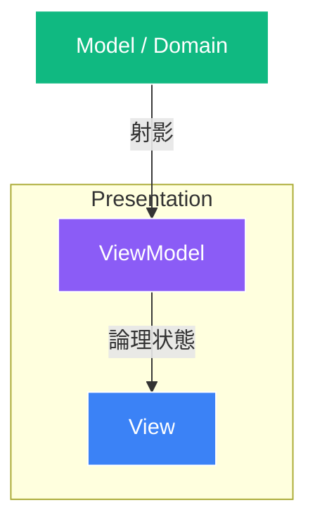

# MVVMはなぜゲームに<br><span class="text-red-400">向かない</span>と言われがちなのか？

状態の投影と、ゲームの時間軸

<div class="pt-8 text-sm opacity-60">
  5分LT / 矢印キーでめくってください
</div>

---
layout: default
---

# 1. まず「MVVM = データバインディング」ではない

「ReactivePropertyを使っているからMVVM」ではありません。

<br>

<div class="grid grid-cols-2 gap-6 pt-2">

<div class="p-4 border border-blue-500/30 rounded-xl bg-blue-500/5">
  <h3 class="font-bold text-blue-400 mb-2">🏛️ MVVMの本質</h3>
  <ul class="text-sm space-y-2 text-gray-300">
    <li><b>「責務分割」の設計思想</b></li>
    <li>Viewが取りうる論理状態をViewModelに集約する</li>
    <li>Viewをその「受動的な投影」として扱う</li>
  </ul>
</div>

<div class="p-4 border border-amber-500/30 rounded-xl bg-amber-500/5">
  <h3 class="font-bold text-amber-400 mb-2">🔌 バインディングの正体</h3>
  <ul class="text-sm space-y-2 text-gray-300">
    <li>ViewとViewModelを繋ぐ<b>「実装手段」</b>に過ぎない</li>
    <li>WPFのようなBinding Engineでもいい</li>
    <li>Rxの購読でも、Viewの<code>Initialize(vm)</code>でもいい</li>
  </ul>
</div>

</div>

<br>

> 💡 **バインディングの責務はどこかに必要だが、手法は何でもいい。**<br>
> immutableなViewModelであっても、MVVMの思想は完全に成立します。

---
layout: two-cols
---

# 2. ViewModelとは何か？

Viewの具体的な見た目ではなく、<br>
**「Viewが取りうる論理的な状態」をモデル化したもの**。

<br>

#### 例：HPゲージの境界線
- `CurrentHp / MaxHp`
- `➔ HpRate` (割合)
- `➔ IsDanger` (ピンチ判定)
<div class="text-xs text-blue-400 font-bold">▲ ここまでがViewModelの責務</div>
<div class="text-xs text-amber-400 font-bold">▼ ここからがViewの責務</div>
- `赤色にする / 点滅させる / 揺らす`

::right::

<div class="pl-4 pt-6">



<div class="mt-4 p-3 bg-gray-800 rounded text-xs text-gray-300">
  ViewModelは単なる「Modelのコピー」ではない。<br>
  <b>ModelをPresentation上意味のある状態へ射影したもの</b>。
</div>

</div>

---
layout: default
---

# 3. Mutable VM と Immutable VM

この2つは、**本質的には全く同じ状態モデル**を扱っています。

<br>

<div class="grid grid-cols-2 gap-6">

<div class="p-4 border border-gray-700 rounded-lg bg-gray-900/50">
  <div class="font-bold text-blue-400 mb-1">Mutable（Reactive版）</div>
  <p class="text-xs text-gray-400 mb-2">同一インスタンスの値が時間とともに変化する</p>
  <div class="font-mono text-xs bg-black/50 p-2 rounded">
    vm.Hp.Value = 80;<br>
    vm.Hp.Value = 50;
  </div>
</div>

<div class="p-4 border border-gray-700 rounded-lg bg-gray-900/50">
  <div class="font-bold text-emerald-400 mb-1">Immutable（Snapshot版）</div>
  <p class="text-xs text-gray-400 mb-2">値そのものが世代交代して差し替わる</p>
  <div class="font-mono text-xs bg-black/50 p-2 rounded">
    view.Render(new HpVM(80));<br>
    view.Render(new HpVM(50));
  </div>
</div>

</div>

<br>

- 両者の違いは「何をモデル化しているか」ではなく、**時間方向の変化をどう表現するか**の違い
- 操作で値が変わらないステータス画面なら、**`readonly struct` のViewModelを `Initialize` で渡すだけでも十分MVVM的**

---
layout: two-cols
---

# 4. M と VM/V の間にある巨大な境界

三者が同列に並んでいるわけではありません。

```text
Domain / Model
═══════════════════════════ boundary
Presentation
    ViewModel
       ↓
     View
```

- **Model**: ゲーム世界・業務ルールについての状態
- **ViewModel**: Presentationという**別の問題領域**についての状態

::right::

<div class="pl-4 pt-4">

### Presentationにしか存在しない状態
例：パーティ画面の `SelectedMemberIndex`

- 「Alice/Bob/Carolがいる」<br>
  ➔ **Domainの事実**
- 「今Bobのタブを開いている」<br>
  ➔ **Presentationだけの事実**

<div class="mt-4 p-3 border border-emerald-500/30 bg-emerald-500/10 rounded text-xs text-emerald-300">
  ViewModelは単なるDomainのアダプタではない。<br>
  <b>Presentation DomainそのもののModel</b>である！
</div>

</div>

---
layout: default
---

# 5. VMを「Canonical」にできる領域ほどMVVMは強い

ここでいうCanonicalとは、**「Presentation上、その論理状態をどこで表現するか」**という意味。

<br>

<div class="p-4 border border-blue-500/40 rounded-xl bg-blue-500/10 mb-4">
  <div class="text-lg font-bold text-blue-300 mb-1">
    「ViewをViewModelの従属変数にできる領域」ほど、MVVMは綺麗に成立する。
  </div>
  <div class="text-xs text-gray-300">
    例：<code>SelectedMemberIndex</code> をViewModelだけが持ち、Viewはそこから表示を決める。<br>
    （※アプリ全体のSSoTという意味ではなく、Presentationスコープ内での正準）
  </div>
</div>

<v-click>

### しかし……ゲームではこの前提が崩壊する！

1. **View側のオブジェクト自身が状態を持ち、時間発展する**
2. **Domainの時間と、Presentationの時間が一致しない**

</v-click>

---
layout: default
---

# 6. ゲームの壁①：Viewが単なるViewではない

3DゲームのViewには、受動的な描画にとどまらない**自律システム**が並びます。

<br>

<div class="grid grid-cols-3 gap-3 font-mono text-center text-sm py-2">
  <div class="p-2 bg-gray-800 rounded">Transform</div>
  <div class="p-2 bg-gray-800 rounded">Animator</div>
  <div class="p-2 bg-gray-800 rounded">Rigidbody</div>
  <div class="p-2 bg-gray-800 rounded">NavMeshAgent</div>
  <div class="p-2 bg-gray-800 rounded">ParticleSystem</div>
  <div class="p-2 bg-gray-800 rounded">Timeline</div>
</div>

<br>

<div class="space-y-2 text-sm">

- これらは単なる描画先ではなく、**自身が状態を持ち、毎フレーム時間発展するシステム**
- その状態までViewModelに持ち始めると……
  - `ViewModel.Position` と `Transform.position`
  - `ViewModel.AnimationState` と `Animator`
- **「どちらがCanonicalなのか？」「どう同期するのか？」という泥沼の二重管理が始まる**

</div>

---
layout: default
---

# 7. ゲームの壁②：DomainとPresentationの時間がズレる

ソシャゲの「凸（限界突破）演出」で起きる悲劇。

<br>

```text
Domain:
    API完了 ─────── 3凸確定！ (Modelは即座に最新になる)

Presentation:
    2凸 ── フェード ── 演出ムービー ── reveal ── 3凸！ (演出が終わるまで待ちたい)
```

<br>

<div class="space-y-3 text-sm">

- Model ➔ ViewModel を無条件にReactive Bindingすると……<br>
  **API完了の瞬間に画面が3凸になり、暗転前にネタバレする！**
- 🚨 **「正しい値なのに、正しいタイミングではない」** という問題が発生する。

</div>

---
layout: default
---

# 8. 切るべきは「Model ➔ VMの無条件・即時追従」

ModelとViewModelは、**常時自動同期していれば良いわけではありません。**

<br>

```csharp {all|1-2|4|6|8|all}
// ① Domain上のcommit（通信完了でModelは3凸へ）
var result = await useCase.ExecuteAsync();

await PlayPresentationAsync(result); // ② 演出が終わるのを待つ（VMは2凸のまま！）

viewModel.Apply(result);             // ③ Presentation上のcommit（ここで初めてVMが3凸へ！）

await FadeInAsync();                 // ④ 画面復帰
```

<br>

- View ↔ ViewModel のバインディングはそのままで良い
- **切るべきなのは、Model ➔ ViewModel の無条件な即時追従**
- 二者の同期タイミングを、演出の手続き（async/await）がコントロールする

---
layout: default
---

# 結論：なぜゲームに向かないと言われがちなのか

<br>

<div class="p-5 border-2 border-emerald-500/50 rounded-xl bg-emerald-500/10 mb-4">
  <div class="text-lg font-bold text-emerald-300 mb-1">
    MVVMが得意なのは「状態を表示すること」。<br>
    ゲームが難しいのは「表示そのものにも状態と時間があること」。
  </div>
</div>

<div class="space-y-3 text-sm text-gray-300">

- **MVVMが輝く領域**:
  - 設定画面、ショップ、インベントリ、ステータス画面
  - ➔ **「Presentationの論理状態をViewModelに置き、Viewをその投影にできる問題」**
- **MVVMが破綻する領域**:
  - インゲーム、3D空間、リアルタイム演出
  - ➔ View自身が状態を持って時間発展し、DomainとPresentationで時間軸まで異なる世界
- ゲーム全体をMVVMの状態同期モデルに押し込もうとするから、同期と二重管理の地獄が生まれる。

</div>

---
layout: center
class: text-center
---

# まとめ

<div class="text-2xl font-bold py-6 leading-relaxed">
  MVVMがゲームに向かないのではない。<br><br>
  <span class="text-amber-400">「Viewを単なる投影にできる領域」</span>を見極め、<br>
  道具の適材適所で気持ちよくゲームを作ろう！
</div>

<br>

ご清聴ありがとうございました 🙌
